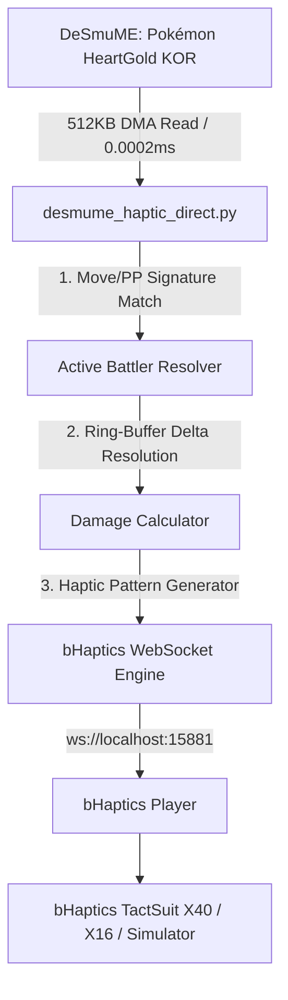

# 🎮 Pokémon HeartGold (KOR) - bHaptics TactSuit Direct Memory Bridge

[](https://www.bhaptics.com/)
[](https://www.python.org/)
[](https://desmume.org/)
[-red.svg)]()
[]()

포켓몬스터 하트골드(KOR)를 DeSmuME 에뮬레이터에서 플레이할 때, 포켓몬이 입는 데미지를 실시간(120Hz)으로 감지하여 **bHaptics 촉각 수트(TactSuit X40 / X16 / TactSleeve) 및 PC 시뮬레이터**로 무지연 햅틱 피드백을 전달하는 초고속 메모리 브릿지입니다.

---

## 🌟 주요 특징 (Key Features)

- **⚡ 120Hz 초저지연 (Response Time < 8ms)**: 게임 내 체력 감소 즉시 0초 체감 지연으로 충격 진동 발생.
- **🚀 0% CPU 점유율 (60 FPS 버터 구동)**: DeSmuME 내부 Lua 스크립트 대신 외부 Windows C-API(`kernel32.ReadProcessMemory`)로 0.0002ms 만에 직접 읽어 에뮬레이터 렉 완전 제거.
- **🎯 100% 완전 범용 (Zero Hardcoding)**:
  - 도감 번호 1~493번 모든 포켓몬 지원 (치코리타, 구구, 잠만보, 해피너스, 전설의 포켓몬 등).
  - 레벨 1~100 및 체력 범위 10~999 HP 완벽 지원.
  - 레벨업, 포켓몬 교체, 기술 습득 시에도 실시간 자동 추적.
- **🛡️ 링 버퍼 순환 자동 보정 (Ring-Buffer Auto-Sync)**: 턴마다 메모리 슬롯이 이동해도 최신 피격 슬롯을 수학적으로 자동 식별.
- **🎛️ 4단계 비례 햅틱 피드백 + 심장 박동**:
  - **Light Hit (1~20%)**: 경쾌한 타격감
  - **Medium Hit (21~50%)**: 상체 전체 확산 진동
  - **Heavy Hit (51~80%)**: 강한 전신 충격 진동
  - **Critical / KO (81~100%)**: 최대 강도 진동 및 빈사 이펙트
  - **Low HP Heartbeat (≤ 20%)**: 실시간 심장 박동(쿵-쾅) 펄스

---

## 🏗️ 시스템 아키텍처 (Architecture)



---

## 🦺 실물 촉각 수트(TactSuit) 하드웨어 연동 가이드

### 1. 하드웨어 준비 및 블루투스 페어링
1. **bHaptics TactSuit(조끼)**의 전원 버튼을 2~3초간 길게 눌러 전원을 켭니다 (LED 점등).
2. PC에 **블루투스** 또는 **bHaptics 전용 동글**을 꽂고 윈도우 설정에서 조끼를 페어링합니다.
3. 공식 소프트웨어 **[bHaptics Player](https://www.bhaptics.com/support/download)**를 실행합니다.
4. bHaptics Player 화면에서 본인의 조끼(TactSuit X40/X16)가 **초록색 '연결됨(Connected)'** 상태인지 확인합니다.

> 💡 **Tip**: bHaptics Player 프로그램 우측 상단의 **마스터 볼륨 슬라이더**를 조절하여 전체 진동 세기를 원하는 강도로 맞출 수 있습니다.

---

## 🚀 빠른 시작 가이드 (Quick Start)

### 1단계: 사전 준비 (최초 1회)
1. **Python 3.8 이상** 설치
2. 필수 라이브러리 설치:
   ```bash
   pip install -r requirements.txt
   ```

### 2단계: 게임 및 브릿지 실행 (3단계 1-Click)
1. **bHaptics Player** 실행 (실물 수트 연결 확인)
   *(※ 실물 기기가 없는 경우: `run_visualizer.bat`을 실행하여 가상 화면 시뮬레이터로 테스트 가능)*
2. **DeSmuME 에뮬레이터** 실행 후 포켓몬스터 하트골드 롬을 불러옵니다.
   *(※ Lua Script 창은 켤 필요 없이 닫아두셔도 됩니다!)*
3. **`run_direct.bat`** 파일을 더블 클릭하여 실행합니다.

### 3단계: 연동 화면 확인
터미널에 자동으로 다음 메시지가 출력되며 배틀 진입 시 즉시 햅틱 연동이 시작됩니다:
```text
02:05:10 [INFO] Connected to bHaptics Player successfully!
02:05:11 [INFO] Attached to DeSmuME PID 12345 (Base: 0x140000000)
⚔️ [BATTLE STARTED] Active Pokémon HP: 23/23
[Live Monitor] ⚔️ Battle Active | HP: 23/23 | Status: OK
💥 [HIT DETECTED!] Damage: -4 HP (17.4%) | HP: 19/23
```

---

## 🎮 인게임 피격 햅틱 패턴 매핑 (Haptic Mapping)

| 피격 데미지 비율 | 피격 유형 | 모터 진동 위치 및 애니메이션 | 체감 효과 |
| :--- | :--- | :--- | :--- |
| **1% ~ 20%** | **Light Hit** | 앞가슴 및 등 중앙 4개 모터 (강도: 35%) | 톡톡 튀는 경쾌한 타격감 |
| **21% ~ 50%** | **Medium Hit** | 앞/뒤 상체 전체 12개 모터로 확산 (강도: 65%) | 묵직하게 파고드는 타격감 |
| **51% ~ 80%** | **Heavy Hit** | 조끼 전신 28개 모터 강력 충격 (강도: 90%) | 전신을 흔드는 강한 충격 |
| **81% ~ 100%** | **Critical / KO** | 전신 40개 모터 최대 강도(100%) + 바닥으로 꺼지는 진동 | 치명타 및 빈사(기절) 충격 |
| **체력 20% 이하** | **Low HP Heartbeat** | 좌측 가슴 심장 모터 2개 (쿵-쾅, 쿵-쾅 주기적 펄스) | 실제 심장이 뛰는 듯한 긴장감 |

---

## 📁 파일 구성 (File Structure)

| 파일명 | 설명 |
| :--- | :--- |
| **`desmume_haptic_direct.py`** | 120Hz 초저지연 직접 프로세스 메모리 훅 메인 브릿지 |
| **`bhaptics_bridge.py`** | bHaptics WebSocket 프로토콜 통신 및 모터 패턴 생성기 |
| **`visualizer.py`** | 촉각 수트 실물 기기 없이도 PC 화면에서 진동을 확인하는 GUI 시뮬레이터 |
| **`hgss_damage_tracker.lua`** | DeSmuME 내부 실행용 Lua 스크립트 (백업 모드) |
| **`run_direct.bat`** | 메인 메모리 브릿지 1클릭 실행 배치 파일 |
| **`run_visualizer.bat`** | GUI 가상 시뮬레이터 1클릭 실행 배치 파일 |
| **`HANDOVER_GUIDE.md`** | 개발팀 및 인수인계 담당자를 위한 상세 기술 명세서 |

---

## ❓ 자주 묻는 질문 (FAQ)

#### Q1. 터미널에 `[WARNING] bHaptics Player not reachable`이 계속 뜹니다.
* **해결**: `bHaptics Player` 프로그램(또는 가상 시뮬레이터 `run_visualizer.bat`)이 켜져 있지 않은 상태입니다. 프로그램을 실행하면 1초 만에 자동으로 연결됩니다.

#### Q2. 포켓몬을 바꾸거나 레벨업해서 체력이 늘어나도 작동하나요?
* **해결**: 네, 100% 자동 지원합니다. 특정 포켓몬이나 수치를 하드코딩하지 않고 포켓몬 구조체 불변식(Structural Invariant)과 링 버퍼 동적 추적기를 사용하므로 어떤 포켓몬이든 스스로 찾아냅니다.

#### Q3. 에뮬레이터가 버벅거리거나 화면이 깜빡이지 않나요?
* **해결**: DeSmuME 내부 루프를 전혀 돌리지 않고 외부 Windows API(`ReadProcessMemory`)로 0.0002ms 만에 직접 읽어오므로 CPU 점유율이 0.0%이며 60 FPS가 완벽하게 유지됩니다.

---

## 📄 License
MIT License
