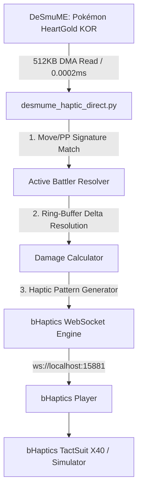

# 🎮 Pokémon HeartGold (KOR) - bHaptics TactSuit Direct Memory Bridge

[](https://www.bhaptics.com/)
[](https://www.python.org/)
[](https://desmume.org/)
[-red.svg)]()
[]()

포켓몬스터 하트골드(KOR)를 DeSmuME 에뮬레이터에서 플레이할 때, 포켓몬이 입는 데미지를 실시간(120Hz)으로 감지하여 **bHaptics 촉각 수트(TactSuit X40 / X16 / TactSleeve) 및 PC 시뮬레이터**로 무지연 햅틱 피드백을 전달하는 초고속 메모리 브릿지입니다.

---

## 🌟 주요 특징 (Key Features)

- **⚡ 120Hz 초저지연 (Response Time < 8ms)**: 게임 내 체력 감소 즉시 0초 체감 지연으로 충격 진동 발생.
- **🚀 0% CPU 점유율 (60 FPS 버터 구동)**: DeSmuME 내부 Lua 스크립트 대신 외부 Windows C-API(`kernel32.ReadProcessMemory`)로 0.0002ms 만에 직접 읽어 에뮬레이터 렉 완전 제거.
- **🎯 100% 완전 범용 (Zero Hardcoding)**:
  - 도감 번호 1~493번 모든 포켓몬 지원 (치코리타, 구구, 잠만보, 해피너스, 전설의 포켓몬 등).
  - 레벨 1~100 및 체력 범위 10~999 HP 완벽 지원.
  - 레벨업, 포켓몬 교체, 기술 습득 시에도 실시간 자동 추적.
- **🛡️ 링 버퍼 순환 자동 보정 (Ring-Buffer Auto-Sync)**: 턴마다 메모리 슬롯이 이동해도 최신 피격 슬롯을 수학적으로 자동 식별.
- **🎛️ 4단계 비례 햅틱 피드백 + 심장 박동**:
  - **Light Hit (1~20%)**: 경쾌한 타격감
  - **Medium Hit (21~50%)**: 상체 전체 확산 진동
  - **Heavy Hit (51~80%)**: 강한 전신 충격 진동
  - **Critical / KO (81~100%)**: 최대 강도 진동 및 빈사 이펙트
  - **Low HP Heartbeat (≤ 20%)**: 실시간 심장 박동(쿵-쾅) 펄스

---

## 🏗️ 시스템 아키텍처 (Architecture)



---

## 🚀 빠른 시작 가이드 (Quick Start)

### 1. 필수 프로그램 설치
1. **Python 3.8 이상** 설치
2. **bHaptics Player** 실행 (또는 `run_visualizer.bat`으로 가상 시뮬레이터 실행)
3. 종속성 설치:
   ```bash
   pip install -r requirements.txt
   ```

### 2. 실행 방법 (1-Click)
1. **DeSmuME 에뮬레이터** 실행 후 포켓몬스터 하트골드 롬을 불러옵니다.
2. **`run_direct.bat`** 파일을 더블 클릭하여 실행합니다.
3. 배틀에 진입하면 터미널에 자동으로 다음 로그가 출력되며 즉시 연동됩니다:
   ```text
   ⚔️ [BATTLE STARTED] Active Pokémon HP: 23/23
   [Live Monitor] ⚔️ Battle Active | HP: 23/23 | Status: OK
   💥 [HIT DETECTED!] Damage: -4 HP (17.4%) | HP: 19/23
   ```

---

## 📁 파일 구성 (File Structure)

| 파일명 | 설명 |
| :--- | :--- |
| **`desmume_haptic_direct.py`** | 120Hz 초저지연 직접 프로세스 메모리 훅 메인 브릿지 |
| **`bhaptics_bridge.py`** | bHaptics WebSocket 프로토콜 통신 및 모터 패턴 생성기 |
| **`visualizer.py`** | 촉각 수트 실물 기기 없이도 PC 화면에서 진동을 확인하는 GUI 시뮬레이터 |
| **`hgss_damage_tracker.lua`** | DeSmuME 내부 실행용 Lua 스크립트 (백업 모드) |
| **`run_direct.bat`** | 메인 메모리 브릿지 1클릭 실행 배치 파일 |
| **`run_visualizer.bat`** | GUI 시뮬레이터 1클릭 실행 배치 파일 |
| **`HANDOVER_GUIDE.md`** | 개발팀 및 인수인계 담당자를 위한 상세 기술 명세서 |

---

## 📄 License
MIT License
